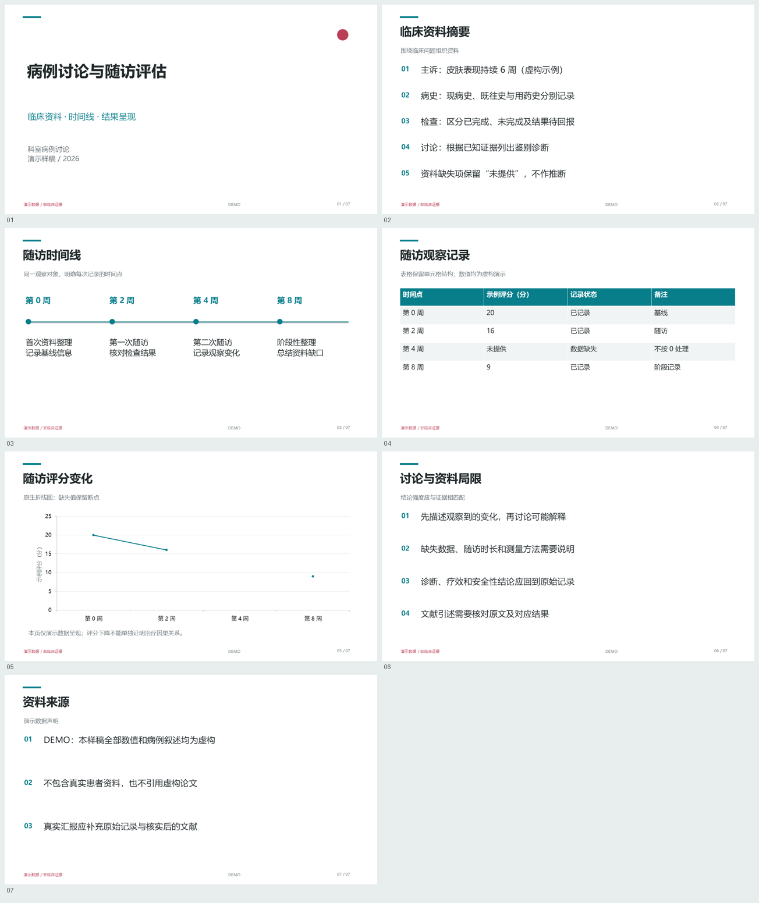

# Medical Editable PPT

面向医学病例讨论、文献汇报和学术报告的可编辑 PowerPoint skill。

**v0.1.1：中文医学内容组织 + 原生 PPTX 生成 + 图形排版指导 + 对象结构检查。**

根据实际汇报反馈，新增了[视觉排版要求](references/visual-composition.md)：处理意外大块留白、放大章节编号、根据内容选用机制图和流程图、避免连续治疗页只有同一种文字双栏。该更新属于 skill 的创作与验收指导；通用 JSON 生成器仍提供下述六种基础布局。

自定义随访图还可参考[原生图表指导](references/native-charts.md)：明确百分数录入方式、错开重合标签、保持标签颜色，以及追加幻灯片时为每张图保留独立的内嵌工作簿。此指导不代表通用 JSON 生成器新增了相应配置字段。



它把文字生成为文本框，把表格生成为单元格，把基础图表生成为带内嵌工作簿的 PowerPoint 图表。生成后可以在 PowerPoint 中继续修改。临床照片和文献原图保留为独立图片，图片内部文字不承诺可编辑。

## 当前能力

| 内容 | 输出形式 | 支持情况 |
| --- | --- | --- |
| 标题、正文、讲者备注 | 原生文本 | 支持中文 |
| 病例时间线 | 原生形状、连接线与文本 | 2-5 个节点 |
| 检查或随访结果表 | 原生 PowerPoint 表格 | 2-5 列，最多 8 行数据 |
| 折线图、柱状图 | 原生图表 + 内嵌 XLSX | 支持多系列、负数和缺失值 |
| PNG/JPEG 图像 | 独立可替换图片 | 等比例完整放置，保留图注和替代文本 |
| 引用 | 页脚来源 ID + 备注完整出处 | 需要提供或核实来源 |

## 开始使用

需要 Python 3.10+。建议在虚拟环境或已有的受管理 Python 环境中安装依赖：

```sh
python -m pip install -r requirements.txt
python scripts/build_deck.py examples/case-demo.json --output build/my-demo.pptx
python scripts/audit_pptx.py build/my-demo.pptx --manifest build/my-demo.manifest.json --output build/my-demo.audit.json
python -m unittest discover -s tests -v
```

脚本以 `python` 为示例，请使用本机实际可用的 Python。输出文件已存在时，生成器会要求换一个文件名，避免覆盖。重复运行上述示例时，可使用新的输出文件名。

下载后的整个目录就是一个 skill。可向支持 skills 的助手提供本目录路径和 `SKILL.md`；在 Codex 中也可以用 `$skill-installer` 从发布后的 GitHub 仓库安装。当前官方文档列出了 `.agents/skills` 等发现目录，具体安装位置以使用的产品版本为准，不要求修改原有 PPT skill。

仓库地址：[20000601chenkai/med-ppt-editable](https://github.com/20000601chenkai/med-ppt-editable)。在有 `$skill-installer` 的环境中，可以直接发送：

```text
用 $skill-installer 安装 https://github.com/20000601chenkai/med-ppt-editable 中的 skill。
```

安装并启用后，可这样使用：

```text
用 $med-ppt-editable 把我提供的脱敏病例整理成 10 页中文病例讨论 PPT。
保留原始资料，文字、表格和基础图表需要可编辑。
没有提供的信息请标记缺失，附上可修改的源文件与检查报告。
```

```text
用 $med-ppt-editable 整理这篇论文，汇报时间 15 分钟。
保留研究设计、样本量、主要结局、置信区间和局限。
核对引用；没有原始数据的论文图保留为原图，不编造数据重画。
```

## 示例

- [7 页病例演示 PPTX](examples/case-demo.pptx)
- [病例演示源数据](examples/case-demo.json)
- [文献汇报结构稿](examples/journal-club.json)
- [结构检查报告](examples/case-demo.audit.json)
- [验证记录](VALIDATION.md)

所有公开示例均为虚构演示或明确的缺失信息占位，不含真实患者资料，不作为临床证据。

## 可编辑性与限制

“可编辑”分成不同层次：修改文字、修改表格单元格、修改图表数据、替换图片。本项目逐类检查对象，不用一个“100% 可编辑”的数字掩盖差别。

当前生成器提供六种固定布局，适合先做内容清楚、可修改的汇报底稿。它尚不支持任意现成 PPT 模板的完整保留、PowerPoint 手工修改与 JSON 自动合并、可编辑公式、SmartArt、动画、复杂统计图或一键 PDF 提取。skill 可以使用宿主已有的文档阅读工具，但这些能力不属于本生成器。

结构检查不是视觉保证，也不能代替医学审稿。应检查实际导出的 PPTX。字体、图表样式在不同办公软件中可能变化；未实际测试的 WPS、Keynote 或 LibreOffice 版本不宣称兼容。

医学图片默认保留源图像字节，不自动压缩、增强或生成替代图。发布前仍需人工检查隐私：PowerPoint 裁剪并不会删除图片中的原始像素，备注和文档属性也可能包含个人信息。本项目不提供自动脱敏保证。

## 成本和许可

生成器在本地运行，不调用付费绘图或模型 API。首次安装依赖需要联网，运行 skill 的 AI 产品本身可能有订阅或使用费用。离线生成不等于整个工作流完全免费。

本项目代码和随包演示采用 [MIT License](LICENSE)。图片、论文和其他用户提供材料的使用权由各自权利人保留。实现独立编写，没有复制 PPT Master 的代码或模板。

技能格式参考：[OpenAI Build Skills](https://learn.chatgpt.com/docs/build-skills)。
